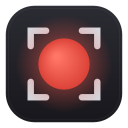

<p align="center">
  
</p>

<h1 align="center">Frame</h1>
<p align="center">A screen-area recorder with a wide, flat, macOS-style floating "pill".<br>
Two native tools, one look — <b>Linux (GNOME Wayland)</b> and <b>Windows 11</b>.</p>

---

Select any region, hit record, and get a **GIF**, **WebM**, or **MP4**. The controller
is a translucent rounded pill you drag anywhere — it morphs into a live timer with
**pause/resume** and **stop** while recording.

## The pill

```
 IDLE       ●  [ GIF · WEBM · MP4 ]   No delay ▾   ⚙        ●  Record   ✕
 RECORDING  🔴  0:07   1280 × 720                     Pause      Stop
```

## Two tools, one design

| | Linux tool | Windows tool |
|---|---|---|
| Toolkit | Python + GTK4 | C# / .NET (WPF) |
| Capture | Mutter ScreenCast + PipeWire + GStreamer | GDI BitBlt (in-box) |
| Formats | GIF · WebM · MP4 | GIF · MP4 |
| Encoding | GStreamer + ffmpeg (GIF) | Media Foundation (MP4) + WPF (GIF) |
| Ships as | `.rpm` / `.deb` / AppImage | single self-contained `frame.exe` |

The **Windows** build has **no major dependencies** — it uses only APIs already in
Windows 11 and bundles the .NET runtime inside one `frame.exe`. See
[`windows/README.md`](windows/README.md).

## Features (both tools)

- Wide, flat, translucent macOS-style **pill** — frameless and draggable
- Drag-to-select region with a live `W×H` readout — on Linux an overlay opens on
  **every monitor**, so you drag on whichever one you want
- **GIF** with proper looping + frame delays, plus **MP4** (and **WebM** on Linux)
- **Pause / Resume** mid-recording (`Space`), **Stop** (`Esc`)
- Linux: **GNOME top-bar controls** and **global hotkeys** so you can pause/stop even
  when the pill is hidden behind the window you're capturing (see below)
- On-screen **countdown** overlay for delayed starts (0 / 3 / 5 / 10 s)
- Settings: **capture cursor** toggle and **frame rate**; version shown in the ⚙ menu
- **Remembers** your last format, delay, cursor, and frame rate
- After saving: **Open**, **Reveal in Files/Explorer**, **Copy path**
- Files saved to `~/Videos` (Linux) / `%USERPROFILE%\Videos` (Windows)

## Linux — install / run

Requires GNOME on Wayland (Mutter ScreenCast + PipeWire), Python 3.10+, GTK4,
libadwaita, GStreamer, and ffmpeg (for GIF). Tested on **Fedora 44 (M1/arm64)** and
**Ubuntu 26.04 (x86_64)**.

Install a package:

```bash
sudo apt install ./frame_2.2.0_all.deb        # Debian / Ubuntu
sudo dnf install ./frame-2.2.0-1.fc44.noarch.rpm   # Fedora
./frame-2.2.0-x86_64.AppImage                 # AppImage (bundles ffmpeg)
```

…or run from source:

```bash
./install-deps.sh     # Debian/Ubuntu deps (Fedora: see below)
./run.sh              # or: python3 -m frame
```

Fedora deps:

```bash
sudo dnf install python3-gobject gtk4 libadwaita \
  gstreamer1-plugins-base gstreamer1-plugins-good \
  gstreamer1-plugins-bad-free gstreamer1-plugin-pipewire ffmpeg
```

## Top-bar controls & global hotkeys (Linux)

On Wayland an app can't force itself always-on-top, so while you record another
window the pill can get buried. Two ways to keep Pause/Stop reachable:

**GNOME top-bar indicator** — a record icon appears in the top bar *only while
recording*, with **Pause/Resume** and **Stop**. It drives Frame over D-Bus. The
`.deb`/`.rpm` already ship it to `/usr/share/gnome-shell/extensions/`; enable it with:

```bash
gnome-extensions enable frame@professorcam.github.io
```

If you ran from source (or want a per-user copy), install it first:

```bash
./install-extension.sh        # copies to ~/.local/share/gnome-shell/extensions/
```

> **Important — one-time reload.** GNOME Shell only discovers a newly installed
> extension at login. On **Wayland** (Debian/Ubuntu/Fedora default) you must **log
> out and back in once**, then `enable`. On **X11** press `Alt+F2`, type `r`, Enter.
> Remember the indicator only shows **while a recording is active**.

**Global hotkeys** — `Ctrl+Alt+P` (pause/resume) and `Ctrl+Alt+S` (stop), registered
via `xdg-desktop-portal`. They work regardless of which window is focused, and are
rebindable in **Settings ▸ Keyboard**. If your desktop's portal doesn't implement
`GlobalShortcuts`, Frame skips them silently and the top-bar indicator still works.

<details>
<summary>Per-distro notes & troubleshooting</summary>

- **Debian / Ubuntu / Fedora** — after installing the package, log out/in (Wayland),
  then `gnome-extensions enable frame@professorcam.github.io`. Optional GUI manager:
  `gnome-shell-extension-manager` (Ubuntu/Debian) or `gnome-extensions-app` (Fedora).
- **"doesn't exist"** on enable → the Shell hasn't scanned it yet: log out/in (Wayland)
  or `Alt+F2 → r` (X11), then retry.
- **Enabled but nothing in the top bar** → it only appears while recording. Confirm the
  app is exporting its service while recording:
  `gdbus introspect --session --dest com.github.frame --object-path /com/github/frame/Control`
- **"incompatible with your GNOME version"** → check `gnome-shell --version`; the
  extension supports 45–51. Stopgap: `gsettings set org.gnome.shell disable-extension-version-validation true`.
- **Remove** → `gnome-extensions disable frame@professorcam.github.io` (package copy is
  removed when you uninstall Frame).

</details>

### Build Linux packages

```bash
./build-deb.sh 2.2.0        # .deb
./build-rpm.sh 2.2.0        # .rpm (on Fedora)
./build-appimage.sh 2.2.0   # AppImage (bundles ffmpeg)
```

All three bundle the GNOME Shell extension and the app icon.

## Windows — build / run

Requires the **.NET 8 SDK** to build (nothing to install to run):

```powershell
cd windows
./build-windows.ps1         # → .../publish/frame.exe
```

Copy `frame.exe` anywhere and run it. Details and an on-device test checklist are in
[`windows/README.md`](windows/README.md).

## Tests (Linux)

```bash
python3 -m unittest discover -s tests -p 'test_*.py'
```

Covers settings persistence (`frame/config.py`), GStreamer pipeline construction
(`frame/recorder.py`), and the D-Bus control interface (`frame/dbus_control.py`).

## License

MIT © Cameron Ryan
